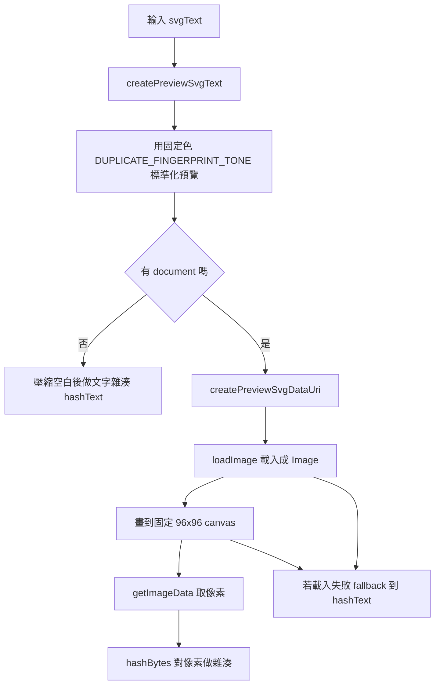

# createSvgVisualFingerprint 開發說明

這份文件是給維護者看的技術說明，目標是幫你快速理解 `createSvgVisualFingerprint` 在做什麼、為什麼這樣做，以及它的限制在哪裡。

函式位置：`src/app/util/svg-preview.ts`

## 這個函式解決什麼問題

`createSvgVisualFingerprint(svgText)` 的目標不是判斷兩份 SVG 原始碼是否完全相同，而是產生一個「偏向視覺結果」的指紋，讓系統可以用它來做以下事情：

- 找出目前批次中視覺上可能相近的圖示
- 比對貼上的外部 SVG 是否和目前批次中的圖示外觀相近

這也是為什麼目前 duplicate review 與 SVG probe 都把它當成啟發式比對，而不是 exact match。

目前的主要呼叫點有兩個：

- `src/app/app.component.ts`
  用在批次疑似重複掃描
- `src/app/svg-probe/svg-probe.component.ts`
  用在貼上 SVG 後的相似圖示查找

## 一句話版摘要

它會先把 SVG 轉成比較容易比較的「標準化預覽版本」，再盡量走瀏覽器的 rasterize 路徑，把圖示畫到固定大小的 canvas 上，最後對像素資料做雜湊；如果目前環境不能這樣做，就退回文字層級的雜湊。

## 整體流程



## 詳細拆解

### 1. 先做視覺標準化，而不是直接 hash 原始字串

函式一進來，第一步不是直接對原始 SVG 字串做 hash，而是先呼叫：

```ts
const normalizedPreviewSvg = createPreviewSvgText(svgText, {
  color: DUPLICATE_FINGERPRINT_TONE,
  contrastPreview: false,
});
```

這一步的重點是：

- 使用固定色 `DUPLICATE_FINGERPRINT_TONE`，目前是 `#8f6a25`
- 不啟用 `contrastPreview`
- 目的是把同一類單色或 `currentColor` 圖示，盡量往同一個「視覺比較基準」拉近

如果直接 hash 原始字串，下面這些其實是同一個圖示的情況，很容易得到完全不同的結果：

- 屬性順序不同
- 空白、換行、縮排不同
- `currentColor` 和具體顏色寫法不同
- 單色圖示只是色值不同，但輪廓完全相同

### 2. createPreviewSvgText 底下做了哪些事

`createPreviewSvgText` 會先透過 `resolvePreviewTone` 決定預覽色調，之後再交給 `recolorSvgText`。

`recolorSvgText` 的主要工作是：

- 先用 `DOMParser` 把 SVG 字串 parse 成 XML / SVG DOM
- 如果 parse 失敗，退回最保守的字串替換：只替換 `currentColor`
- 如果 parse 成功，就分析整棵 SVG 的 paint profile

這裡有幾個重要 helper：

- `classifyPaintValue`
  把 paint 值分類成：
  - `skip`
  - `current`
  - `complex`
  - `color`
- `collectPaintProfile`
  掃描 `fill`、`stroke`、`color`、`stop-color` 與 inline style，判斷這份 SVG：
  - 有沒有用到 `currentColor`
  - 是否屬於可安全重染色的單色圖示

目前會被視為「比較適合重染色」的條件是：

- 沒有 complex paint
- 而且只有一種 solid color，或完全以 `currentColor` 為主

如果 SVG 使用了這些內容，通常會被歸在 `complex`：

- `url(...)`
- `var(...)`
- 無法直接解析成顏色的值

這代表函式不是要硬把所有 SVG 都染成同色，而是優先處理對 icon workflow 最有代表性的那一批：單色、`currentColor`、可重著色圖示。

### 3. 為什麼先標準化顏色

這是整個函式最值得知道的設計點。

如果兩個 icon 只有顏色不同，但形狀完全一致，在 duplicate review 的語境裡，通常還是很值得被視為同一組候選。這也是為什麼這裡故意把顏色壓到固定 tone，再去做後續 fingerprint。

換句話說，這個函式比較在意的是：

- 形狀
- 填色輪廓分布
- 視覺構圖

它比較不在意的是：

- 原始碼格式
- 單色 icon 的具體色值

## 瀏覽器環境下的主要路徑

### 4. 為什麼不是直接 hash 標準化後的字串

因為就算標準化之後，兩份 SVG 還是可能有很多「程式碼層級不同、視覺結果相同」的情況，例如：

- `<path>` 拆分方式不同
- 屬性順序不同
- `transform` 與等價 path 結構不同
- 小數精度不同但肉眼結果相同

所以它會盡量走更接近「真正畫出來長怎樣」的路徑。

### 5. 轉成 data URI 並載入成圖片

標準化後的 SVG 會經過：

```ts
createPreviewSvgDataUri(normalizedPreviewSvg, { contrastPreview: false });
```

這一步會：

- 再次走 `createPreviewSvgText` 的流程
- 用 `encodeSVG` 做可放進 URI 的轉義
- 產生 `data:image/svg+xml,...`

接著用 `loadImage`：

- 建立 `Image()`
- 設定 `decoding = 'async'`
- 等待 `onload`

這一步的本質是把 SVG 交給瀏覽器自己的渲染器處理。

### 6. 畫到固定大小 canvas

載入成功後，函式會建立一個固定大小的 canvas：

- `PREVIEW_CANVAS_SIZE = 96`
- canvas 尺寸固定為 `96 x 96`

之後會做這幾件事：

- 讀出圖片原始寬高
- 算出等比縮放比例
- 讓圖示完整落在 96x96 內，不裁切
- 置中繪製到 canvas

這一段的設計重點是「把不同原始尺寸的 SVG 都投影到同一個比較平面上」。

因此最後比較的不是原始 viewBox 或實際輸出大小，而是它在固定基準畫布上的像素結果。

### 7. 對像素做雜湊

畫完後會透過：

```ts
const imageData = context.getImageData(0, 0, 96, 96);
return hashBytes(imageData.data);
```

也就是直接對 `Uint8ClampedArray` 的 RGBA bytes 做雜湊。

這裡的 `hashBytes` 與 `hashText` 都是偏 FNV-1a 風格的輕量 hash：

- 起始值 `2166136261`
- 每步先 XOR
- 再乘 `16777619`
- 最後轉成 8 位十六進位字串

它的特性是：

- 很快
- 足夠當 map key / 分群 key
- 不是 cryptographic hash
- 可能碰撞，但在這個用途上可接受

## 非瀏覽器或失敗情境的 fallback

### 8. 沒有 document 時

如果目前環境沒有 `globalThis.document`，函式不會嘗試走 image + canvas 路徑，而是直接：

- 對標準化後的 SVG 做空白壓縮
- 再用 `hashText` 做文字雜湊

也就是：

```ts
hashText(normalizedPreviewSvg.replace(/\s+/g, " ").trim());
```

這讓它在沒有完整 DOM / Canvas 能力的環境下仍然可以工作。

### 9. image decode 或 canvas 失敗時

如果這些步驟失敗：

- `loadImage` 失敗
- `canvas.getContext('2d')` 拿不到 context
- 其他 try block 內錯誤

它也會退回 `hashText` 路徑。

這表示函式設計上不是「只能在最佳情況下工作」，而是有明確的多層 fallback。

## 值得知道的知識點

### 10. 這是 heuristic，不是 exact duplicate detector

它的語義應該理解成：

- 「看起來可能相似」
- 不是「保證完全相同」

實務上要一直記得：

- 相同 fingerprint 不代表一定可以安全刪除其中一個
- 不同 fingerprint 也不代表兩者一定毫不相似

這個函式的輸出最適合拿來做：

- 候選分群
- 快速縮小人工 review 範圍

### 11. 它對單色 icon 特別友善

因為標準化重點放在 `currentColor` 和單色 paint profile，所以它對以下情境很有用：

- 設計系統 icon
- 單色產品 icon
- 使用 `currentColor` 的 component icon

但對這些情境就比較保守：

- 多色插圖
- gradient / filter / mask 很重的 SVG
- 顏色本身就是語義的一部分

### 12. 它把「程式碼差異」轉成「像素差異」

這是它比單純 hash markup 更有價值的地方。

只要最後 rasterize 出來的結果接近，即使原始碼結構不同，仍然有機會落到相同指紋。

但也因為如此，這個函式本身成本比純文字 hash 高不少，主要成本在：

- `DOMParser`
- SVG 重染色與 `XMLSerializer`
- `Image` decode
- canvas draw
- `getImageData`

這也是為什麼它目前被用在：

- 批次掃描時的明確動作
- 貼上 SVG 後的主動查找

而不是在每一次字元輸入時即時、無限制地重算整批。

### 13. 固定 96x96 是一種取樣策略

`96 x 96` 不是「正確答案」，而是目前的折衷：

- 太小，細節會被壓掉
- 太大，計算成本會變高

96 對 icon 類素材通常能保留足夠輪廓資訊，同時讓 `getImageData` 的成本維持合理。

### 14. 雜湊碰撞是可能的

因為最後只有 8 位十六進位字串，碰撞理論上一定可能發生。

這在這個產品裡可接受，因為用途是：

- 建立 review 候選
- 不是做安全驗證
- 不是做資料唯一鍵保證

如果未來產品語義升級成更嚴格的圖示去重判定，這一層就不能單獨當最終依據。

## 維護與除錯時可以先看什麼

### 15. 如果比對結果看起來怪，先看這幾件事

1. 這份 SVG 是不是屬於單色 / `currentColor` 圖示
2. 它有沒有用到 gradient、`url(...)`、`var(...)` 或其他 complex paint
3. `createPreviewSvgText` 產出的標準化 SVG 長什麼樣子
4. 現在走的是 canvas 路徑，還是 fallback 的 text hash 路徑
5. 兩個 SVG 看起來很像，但其實在 96x96 的像素取樣下是否已經出現差異

### 16. 如果你要優化它，優先思考 cache，而不是改 hash 演算法

通常更有效的方向會是：

- 對同一份 SVG 內容做 fingerprint cache
- 對標準化後的 preview SVG 做 cache
- 對批次 handle.text() 與預覽資料做 reuse

比起把 FNV 風格 hash 換成更重的 hash，這些 reuse 通常更能降低實際成本。

## 總結

`createSvgVisualFingerprint` 的核心思想是：

- 先把 SVG 往一致的視覺基準標準化
- 再盡量讓瀏覽器真的把它畫出來
- 最後對畫出來的像素結果做輕量雜湊

它不是在回答「這兩段 SVG 原始碼是否一樣」，而是在回答：

「如果把這兩個 SVG 拉到同一個比較基準上，它們看起來是否足夠接近，值得被放進同一組 review 候選？」

這是它在這個專案裡最重要的定位。
