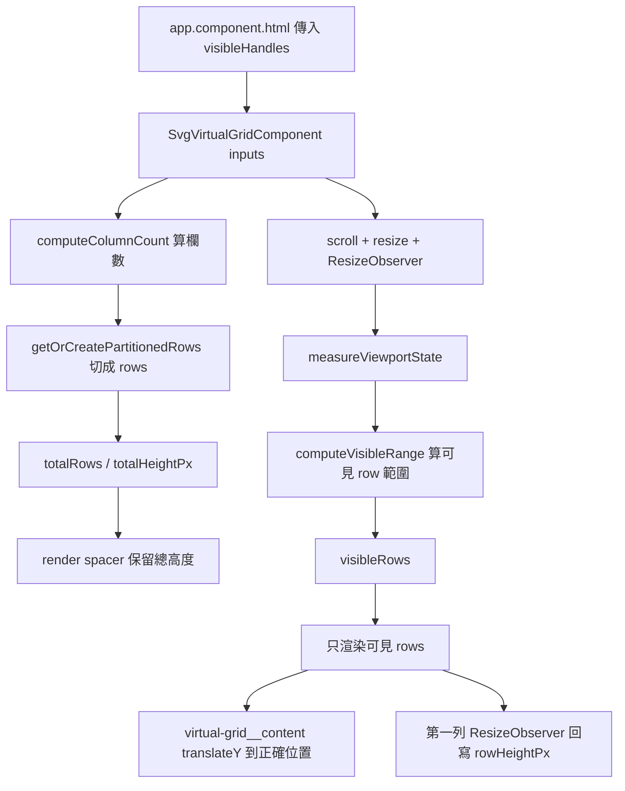

# SVG 虛擬滾動機制開發說明

這份文件是給維護者看的技術說明，目標是幫你快速理解目前專案中的虛擬滾動機制是怎麼運作的、底層取捨是什麼、哪些地方值得注意，以及如果未來需求改變，該往哪個方向演進。

目前實作位置：

- `src/app/svg-virtual-grid/svg-virtual-grid.component.ts`
- `src/app/svg-virtual-grid/svg-virtual-grid.component.html`
- `src/app/svg-virtual-grid/svg-virtual-grid.component.scss`

主要接線位置：

- `src/app/app.component.html`

## 這個元件解決什麼問題

這個元件解決的是「SVG 資產數量變大後，主 grid 不能再把所有卡片一次掛進 DOM」的問題。

先前只靠 `inView` 的做法，本質上只是延後每張卡片何時讀取 SVG 內容，沒有減少：

- Angular component instance 數量
- DOM 節點總數
- template binding 數量
- 卡片上事件監聽與狀態計算

因此當資產很多時，真正的瓶頸仍然是整個 grid 的全量渲染，而不是 `handle.text()` 這一步本身。

現在的 `app-svg-virtual-grid` 改成真正的 windowing：

- 只保留 viewport 附近的 rows 在 DOM 中
- 不在 viewport 內的 rows 只保留高度，不保留實際卡片 DOM

## 為什麼不是直接用一般 list virtual scroll

這裡採用的是「row-based 虛擬 grid」，不是單純的一維 list virtual scroll，原因是目前資產區的特性是：

- 是多欄 grid，不是單欄列表
- 欄數會隨容器寬度與 compact mode 改變
- 使用整頁捲動，不是內嵌的獨立 scroll container
- 每張卡片高度接近固定，但整列的欄數會變

對這種場景來說，最自然的虛擬化單位不是單一卡片，而是「一列 row」。

## 一句話版摘要

它會先依容器寬度算出目前一列能放幾張卡片，再把所有 handles 切成 rows，之後用 spacer 保留整體高度，只渲染 viewport 附近的 rows，並用 `translateY(...)` 把這段可見內容放回正確位置。

## 整體流程



## 目前的資料流與狀態

### 1. 入口資料從哪裡來

在 `app.component.html` 中，主畫面會把目前已過濾後的 `visibleHandles` 傳進來：

- `handles`
- `currentColor`
- `colorInvert`
- `compactMode`
- `duplicateGroupSizeByName`
- `quickPreviewHandleNames`
- `activeHandle`

也就是說，虛擬 grid 本身不決定要顯示哪些檔案，它只負責把「已經決定好要顯示的資料集」高效地渲染出來。

### 2. 內部核心 signal 有哪些

目前最核心的 signal 是三個：

- `columnCount`
  目前一列要放幾張卡片
- `rowHeightPx`
  目前假設每列高度是多少
- `visibleRange`
  目前要渲染哪幾列，格式是 `{ start, end }`

它們再往上推導出：

- `partitionedRows`
- `totalRows`
- `totalHeightPx`
- `offsetTopPx`
- `rowTemplateColumns`
- `visibleRows`

這讓 template 只需要消費已經整理好的 rendering model。

## 底層機制拆解

### 3. 先算目前應該有幾欄

`computeColumnCount(containerWidth, viewportWidth)` 會根據：

- 容器寬度
- 是否是 compact mode
- 是否落在窄螢幕 breakpoint

選擇不同的最小卡片寬度，然後估算目前可放的欄數。

目前用到的常數有：

- `DESKTOP_CARD_MIN_WIDTH_PX = 300`
- `COMPACT_CARD_MIN_WIDTH_PX = 204`
- `COMPACT_CARD_MIN_WIDTH_NARROW_PX = 168`
- `GRID_GAP_PX = 16`

這一步的本質是把 CSS grid 的自適應欄數，投影成一個可供虛擬化使用的明確整數欄數。

### 4. 先把 handles 切成 rows

欄數算出來後，`getOrCreatePartitionedRows(handles, columnCount)` 會把整份 handle 清單切成 rows。

這一步現在有一層 cache：

- `rowPartitionCache: WeakMap<handlesRef, Map<columnCount, rows>>`

也就是說：

- 如果同一個 handles 陣列參考值再次配上相同的 `columnCount`
- 就直接重用之前切好的 rows

這樣滾動時不需要反覆重新 `slice(...)` 整份資料。

### 5. 用 spacer 保留整體高度

虛擬滾動不能真的把整個 grid 高度消失，否則頁面捲軸長度會錯。

所以 template 會先 render 一個：

- `.virtual-grid__spacer`

它的高度是：

```ts
totalRows * rowHeightPx + (totalRows - 1) * GRID_GAP_PX;
```

這個 spacer 的作用是：

- 讓整個區塊在版面上仍然佔據完整高度
- 讓瀏覽器的捲動範圍正確
- 但不需要真的 render 全部卡片 DOM

### 6. 真的渲染的內容是絕對定位的一小段 rows

`.virtual-grid__content` 會用 `position: absolute` 疊在 spacer 上方，只承載目前可見區域附近的 rows。

這一段內容不會從頂部開始畫，而是透過：

```ts
offsetTopPx = visibleRange.start * rowStridePx();
```

再把內容整體 `translateY(...)` 到正確位置。

所以你可以把它理解成：

- spacer 代表「完整長度」
- content 代表「目前真的存在的那一段內容」

### 7. 可見範圍怎麼算

`measureViewportState()` 會做兩件事：

- 重算 `columnCount`
- 重算 `visibleRange`

其中 `computeVisibleRange(...)` 用到的資料是：

- 目前 grid container 的 `getBoundingClientRect()`
- `window.innerHeight`
- `rowHeightPx`
- `columnCount`

它會先估算：

- 目前 viewport 與這塊 grid 有重疊的頂部位置
- 目前 viewport 與這塊 grid 有重疊的底部位置

然後把這個可見像素範圍換算成 row index 範圍。

### 8. overscan 是什麼

目前有：

- `OVERSCAN_ROWS = 3`

意思是除了 viewport 真正看到的 rows 之外，還會多渲染前後各幾列。

目的有三個：

- 避免快速捲動時短暫看到空白
- 降低 visible range 在邊界抖動時的視覺跳動
- 讓卡片進出畫面時更平滑

### 9. 為什麼目前至少保留兩列

`visibleRows` 目前會做這件事：

```ts
const atLeastTwoRowsEnd = Math.max(end, start + 2);
```

也就是即使理論上只需要一列，也盡量保留至少兩列。

這麼做的主要好處是：

- row 高度量測更穩定
- 邊界附近不容易只剩一列而造成觀感跳動
- DOM 切換頻率稍微更平滑

## 事件與量測是怎麼驅動的

### 10. scroll / resize 監聽不在 Angular zone 裡跑

`ngAfterViewInit()` 內會監聽：

- `window.scroll`
- `window.resize`

而且是放在 `runOutsideAngular(...)` 裡。

這個設計很重要，因為 scroll 是高頻事件。如果每次 scroll 都直接進 Angular change detection，成本會高很多。

目前搭配的是：

```ts
auditTime(0, animationFrameScheduler);
```

這表示多次 scroll / resize 事件會被收斂到 animation frame 節奏，而不是每次原始事件都觸發一次計算。

### 11. 什麼時候才真的更新 signal

`measureViewportState()` 不會每次都寫回 state。

它會先比較：

- `columnCountChanged`
- `visibleRangeChanged`

只有這兩者有變化時，才真正 `set(...)` signal。

這是目前避免無效重算的第一層保護。

### 12. ResizeObserver 在這裡做了兩件事

目前有兩個 ResizeObserver：

- `viewportResizeObserver`
  觀察整個 grid 容器尺寸變化
- `rowResizeObserver`
  觀察第一個實際渲染 row 的高度變化

其中第二個很重要，因為目前 row 高度不是完全寫死，而是：

- 先用預設值估算
- 再讓實際渲染出來的第一列回寫真正高度

這樣在 compact mode 或畫面尺寸改變後，虛擬化估算不會長期偏離實際高度。

## 和 `app-svg-card` 的配合

### 13. 虛擬滾動不是單獨成立的，還需要卡片層的重用

虛擬化會讓卡片被卸載、再掛載。這代表如果卡片內部每次掛載都做大量重算，效益會被吃掉。

目前 `app-svg-card` 已經補了兩個重要快取：

- `svgTextCache`
  同一個 `FileWithDirectoryHandle` 不重複讀 `handle.text()`
- `svgPreviewUriCache`
  同一張 SVG 在相同 preview 參數下，不重複生成 preview data URI

因此目前的效能模型是兩層：

- grid 層減少 DOM 數量
- card 層減少重新掛載時的重複計算

## 值得知道的知識點

### 14. 這其實是 windowing，不是物件池式 recycling

目前做的是「只渲染可見範圍附近的資料」，本質上是 windowing。

它不是更激進的 view recycling pool，也就是：

- 不會維持一組固定 card instance 並重新綁資料
- 而是讓 Angular 依照 `@for` 的 key 去建立 / 移除對應 DOM

這個策略比較簡單，也更符合目前這個產品的複雜卡片結構。

### 15. 這套機制假設 row 高度近似固定

目前整體高度與 offset 的計算都建立在：

- 所有 rows 高度可以用同一個 `rowHeightPx` 近似表示

也就是說，它不是 variable-size virtualizer。

如果 row 高度差異很大，下面這些值會開始不準：

- `totalHeightPx`
- `offsetTopPx`
- `visibleRange`

### 16. rowPartitionCache 的 key 是陣列參考值，不是內容 hash

這點非常值得知道。

目前 cache key 是：

- `handles` 陣列本身的參考值
- 加上 `columnCount`

所以如果上游每次都產生全新的陣列實例，cache 會自然失效。

這不一定是壞事，因為 filter 或 duplicate review 狀態改變時，本來就可能需要重新切 row。但如果未來要再深挖效能，這是觀察點之一。

### 17. 它目前跟整頁 scroll 綁定，不是內部 scroll 容器

這一版是用：

- `window.scroll`
- `window.innerHeight`
- 容器 `getBoundingClientRect()`

來決定可見範圍。

這代表：

- 它適合目前這個 page-level scroll 的產品版型
- 如果未來改成內嵌 scroll container，計算方式要跟著改

## 其他地方如果也要套用，該怎麼判斷

### 18. 適合套用的場景

如果你未來在專案裡遇到這些場景，可以考慮套同樣的模式：

- 很長的卡片 grid
- 多欄、自適應欄數的結果清單
- 每個 item 都有自己的事件、狀態、圖片或預覽成本
- item 高度相對穩定

例如未來如果有：

- 超大批次的搜尋結果 grid
- 更大型的 duplicate candidate 視覺牆
- 需要展示很多 SVG 預覽的另一個工作區

就很適合沿用這套 row-based windowing。

### 19. 不太適合直接套的場景

以下情況不一定值得上這套：

- item 很少，十幾個以內
- 每個 item 高度差異很大
- 內容展開收合會頻繁改變高度
- 本身就是單欄列表，其實用現成 list virtualizer 更直接

## 如果未來每行 row 高度不固定，該怎麼做

這是最重要的延伸題。

### 20. 先說結論

如果未來 row 高度不固定，現在這個演算法不能只靠小修小補就完全正確，因為目前它的數學基礎就是「單一 row 高度近似值」。

### 21. 最優先的策略通常不是改演算法，而是先讓高度回到可控

在這個產品裡，通常更好的做法是先問：

- 能不能把卡片主體高度維持一致
- 把可變內容移到側欄、popover 或 markup 區，而不是讓卡片自己長高

如果能這樣做，現有 virtualizer 可以繼續成立，維護成本最低。

### 22. 如果真的必須支援 variable row height

就需要把目前的 fixed-row 演算法升級成 variable-size virtualizer。核心做法通常是：

1. 為每個 row 維護自己的實測高度
2. 維護每個 row 的累積 offset
3. 用 binary search 從 scroll 位置反查目前起始 row
4. 根據累積高度，而不是 `rowIndex * rowHeight`，來算 `offsetTop`
5. 當某列高度改變時，更新其後所有 row 的累積位移

可以把它理解成：

- 固定高度版：用乘法就能找到位置
- 可變高度版：需要 prefix sum / offset table 才能找到位置

### 23. variable row height 版本通常需要的資料結構

實作上常見會多這些結構：

- `rowHeightByIndex: Map<number, number>`
- `rowOffsetByIndex: number[]` 或 prefix sum array
- `estimatedRowHeight`

流程通常會是：

- 先用估算高度撐出初始 layout
- render 後用 `ResizeObserver` 量每一列真實高度
- 把量測結果寫回 height map
- 更新 offset table
- 必要時校正當前 scroll anchor，避免畫面跳動

### 24. 為什麼 variable row height 複雜很多

因為當 viewport 上方某一列的高度被重新量到不同數值時：

- 所有後面 rows 的 offset 都要重算
- 目前使用者看到的內容位置可能會跳
- scroll anchoring 需要特別處理

這也是為什麼很多產品會優先選擇：

- 固定 item 高度
- 或至少把高度變化壓到非常小

### 25. 如果未來真的走 variable row height，實務上的建議

這個專案若真的要往那個方向走，我會建議：

- 保留目前 row-based 思維，不要退回 per-card 思維
- 先導入 per-row height map + prefix offsets
- 保持 overscan
- 把 scroll listener 與量測仍留在 Angular zone 外
- 只在真正需要時才把 state commit 回 Angular
- 若複雜度持續上升，再評估是否要抽成更專門的 virtualizer abstraction

## 如果別的地方要套用，目前這版最值得複製的部分

如果你未來要在其他區塊重用這種模式，最值得沿用的是這幾個組合，而不是單獨抄其中一段：

1. row-based windowing，而不是單 item windowing
2. spacer + absolute content + translateY 的結構
3. `runOutsideAngular` + animation frame 節流
4. `ResizeObserver` 做容器與 row 量測
5. data partition cache
6. item 層自己的內容快取

這六個一起用，才是目前這版效能改善真正成立的原因。

## 總結

目前的 `app-svg-virtual-grid` 是一個針對「多欄、可變欄數、整頁捲動、row 高度近似固定」場景量身設計的 row-based virtualizer。

它的核心不是把每張卡片 individually 追蹤可見性，而是：

- 先把資料切成 rows
- 用單一高度模型估算整體長度
- 只渲染 viewport 附近那一小段 rows
- 再用 item cache 把反覆掛載的成本壓低

如果未來需求還維持「卡片高度接近固定」，這套架構可以繼續擴充；如果未來 row 高度變得明顯不固定，就要升級成 per-row height measurement + prefix offset 的 variable-size virtualizer。
